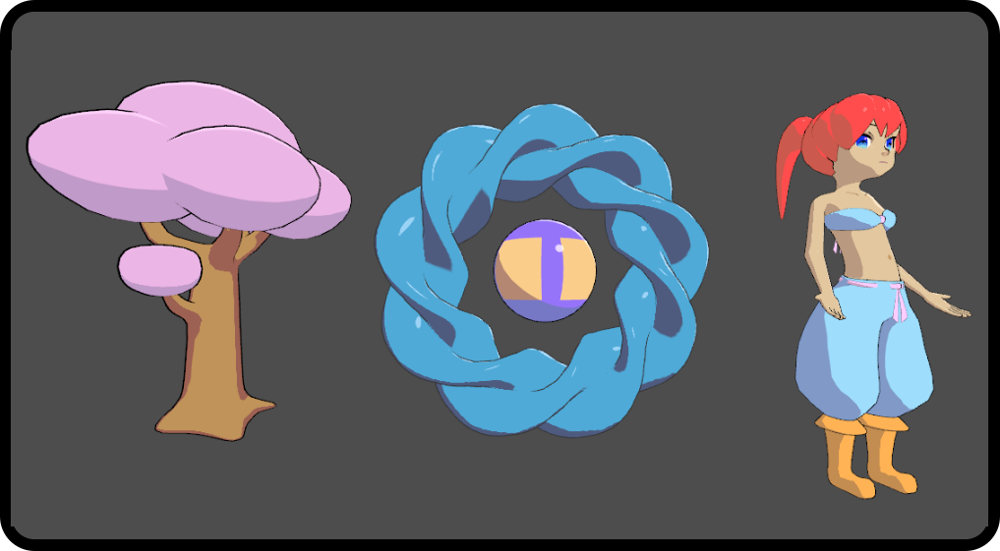

## Godot Cel Shader v1.0.0
#### By David Lipps aka Dave the Dev at EXPWorlds
---

---
This is a demonstration project showcasing the included Cel Shader. All the assets were made by me, feel free to use them. Have fun!

Soon, there will a companion YouTube tutorial, when it comes out the link will be here.

**Shader Parameter Discriptions:**
- Use Shade: Turns shading on or off. (not sure why, but you can)
- Use Specular: Turns specular highlights on or off. Specular makes things look shiney or glossy.
- Use Rim: Turns rim highlights on or off. Rim lighting highlights the edges of an object in direction of a light source.
- Base Use Light Color: The color of the light source multiplies with the base color.
- Specular Use Light Color: The color of the light source multiplies with the specular highlight tint.
- Rim Use Light Color: The color of the light source multplies with the rim highlight tint.
- Base Color: The normal color of the materal when there is no shade or highlights.
- Shade Color: The color of the materal when angle between the light and the surface nomal exceeds the shade threshold (aka the color on the object where there is no light)
- Specular Tint: The color that gets added to the base color where there is a specular highlight.
- Rim Tint: The color that gets added to the base color where there is a rim highlight.
- Shade Treshold: The value which represents the angle between the light and surface normal at which the transistion between base color and shade color occurs.
- Shade Softness: A value which increases or decreases the gradiant amount at the transition between the base and shade colors.
- Specular Softness: A value which increases or decreases the gradiant amount at the transition between the base and specular highlight colors.
- Rim Threshold: A value which controls the treshold angle between the light source, camera angle, and the edge of an object. (aka the higher the value, the more the rim highlight will spread from the edge of the object)
- Rim Spread: A value that deattenuates the spread of rim highlight around the edge of an object. (aka the higher the value, the more the rim highlight will spread around the edge of an object.)
- Rim Softness: A value which increases or decreases the gradiant amount at the transition between the base and rim highlight colors.

**Additional Notes:**
- The black outlines were made using the inverted hull method in Blender.
- The 1.0.0 version of this shader does not suppot textures because in Godot v3.1 the UV variable isn't supported in the light shader function.
- However, the current Godot master branch now does support using UVs in the light shader; therefore, I have written a Cel Shader which uses textures for the base and shade colors and will update this project when the next version of Godot releases.
- It is probably best to use only one directional light, or things will start to look odd. If you need many lights in your scene, make sure cel shaded objects are only affected by one directional light by means of groups and visual layers. 
- A lot of the ideas behind the way this shader works was inspired by Junya C Motomura's 2015 GDC talk linked [here](https://www.youtube.com/watch?v=yhGjCzxJV3E&t=981s).

I can be reached at: davidlipps.dev@gmail.com
I'd love to hear your thoughts. Especially about how I can improve. I'll do my best to get back to you.